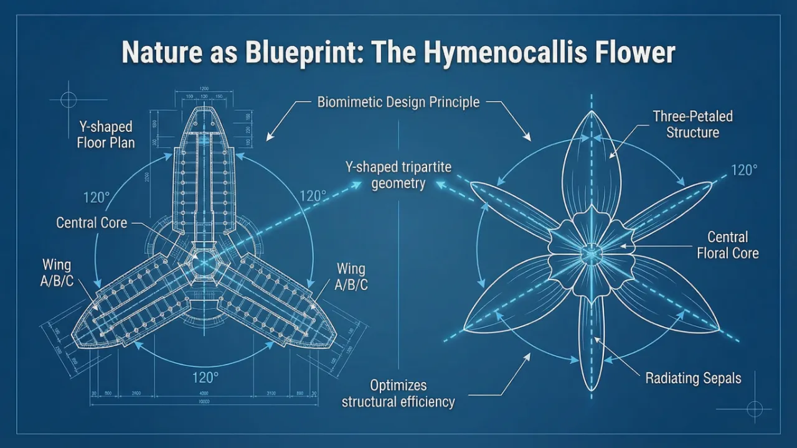
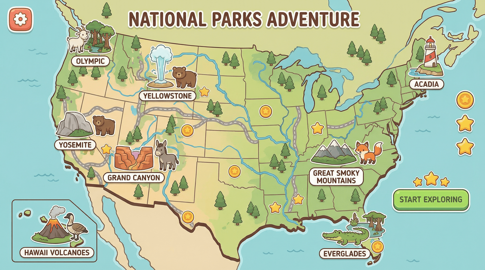
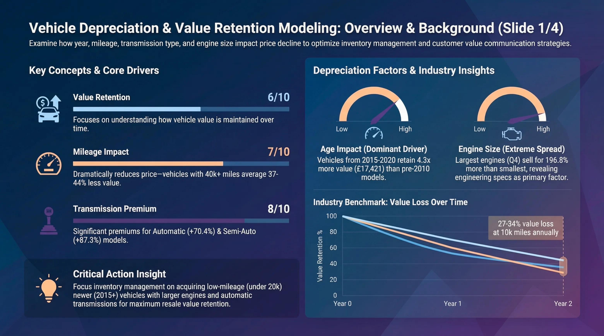
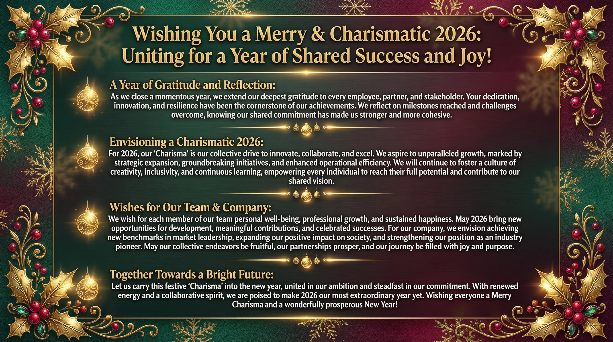
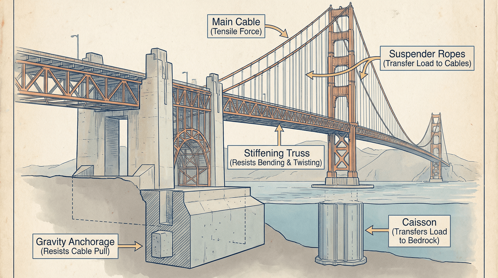
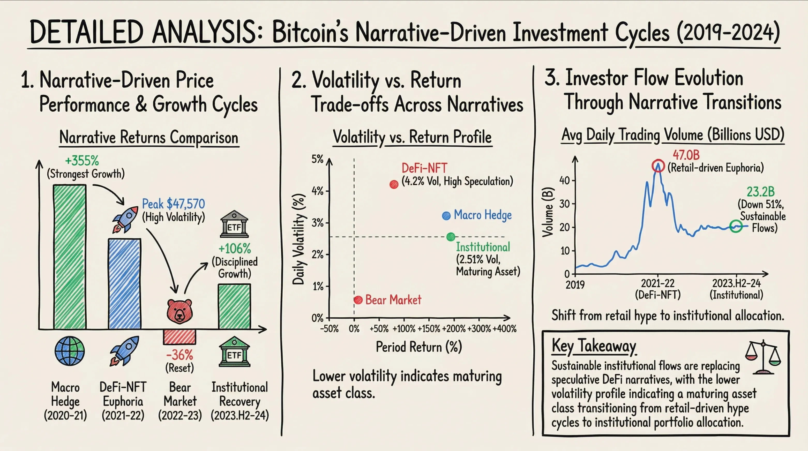

# 🍌 Awesome Nano Banana PPT Prompts

A curated collection of Nano Banana Pro prompts for PPT, infographics with images, multilingual support, and instant gallery preview. Open-source prompt engineering library.

## 📚 Table of Contents

- [About](#about)
- [Prompts Gallery](#prompts-gallery)
- [How to Use](#how-to-use)
- [Contributing](#contributing)
- [License](#license)

## About

This repository contains curated prompts for generating high-quality PPT slides. Each prompt includes:
- Detailed prompt text (if the prompt text is not available, you can use [CREATE LIKE THIS](https://2slides.com/features/create-slides-like-this) feature to generate from the reference image)
- Preview images
- Tags for categorization
- Contributor information
- Usage instructions

## Prompts Gallery

Total: **24** prompts

- ### [Analog film photography aesthetic](prompts/analog-film-photography-aesthetic/prompt.md)

  

  **Tags:** `analog photography`, `35mm film`, `kodak portra`, `hiking life`, `film grain`

  **Contributor:** [2slides](https://github.com/2slides)

- ### [Blueprint Style](prompts/blueprint-style/prompt.md)

  

  **Tags:** `blueprint`, `engineering`

  **Contributor:** [2slides](https://github.com/2slides)

- ### [Christmas classic color theme and elements](prompts/christmas-classic-color-theme-and-elements/prompt.md)

  

  **Tags:** `classic chrismas`, `3d`

  **Contributor:** [2slides](https://github.com/2slides)

- ### [Cute educational game map vector illustration](prompts/cute-educational-game-map-vector-illustration/prompt.md)

  

  **Tags:** `Cute educational`, `game map`, `kids`, `playful`

  **Contributor:** [2slides](https://github.com/2slides)

- ### [Dark data visualization dashboard style](prompts/dark-data-visualization-dashboard-style/prompt.md)

  

  **Tags:** `dark`, `data visualization`, `dashboard`

  **Contributor:** [2slides](https://github.com/2slides)

- ### [Data visualization chart key metrics style](prompts/data-visualization-chart-key-metrics-style/prompt.md)

  

  **Tags:** `data visualization`, `charts`, `key metrics`

  **Contributor:** [2slides](https://github.com/2slides)

- ### [Egyptian theme for junior graders students](prompts/egyptian-theme-for-junior-graders-students/prompt.md)

  

  **Tags:** `Egyptian`, `education`, `student`, `junior graders`

  **Contributor:** [2slides](https://github.com/2slides)

- ### [IBM style with the modern "IBM Carbon" style](prompts/ibm-style-with-the-modern-ibm-carbon-style/prompt.md)

  

  **Tags:** `IBM style`, `IBM Carbon design`

  **Contributor:** [2slides](https://github.com/2slides)

- ### [IBM style with the "Paul Rand" heritage look](prompts/ibm-style-with-the-paul-rand-heritage-look/prompt.md)

  

  **Tags:** `ibm style`, `Paul Rand`, `heritage`

  **Contributor:** [2slides](https://github.com/2slides)

- ### [Luxury Vintage Christmas](prompts/luxury-vintage-christmas/prompt.md)

  

  **Tags:** `Luxury`, `Vintage`, `Christmas`

  **Contributor:** [2slides](https://github.com/2slides)

- ### [McKinsey & Company presentation style](prompts/mckinsey-company-presentation-style/prompt.md)

  

  **Tags:** `McKinsey`, `consultant`, `business`

  **Contributor:** [2slides](https://github.com/2slides)

- ### [Modern Minimalist Christmas](prompts/modern-minimalist-christmas/prompt.md)

  

  **Tags:** `Christmas`, `Modern`, `Minimalist`

  **Contributor:** [2slides](https://github.com/2slides)

- ### [Moody outdoor photography](prompts/moody-outdoor-photography/prompt.md)

  

  **Tags:** `moody photography`, `foggy forest`, `silhouette`

  **Contributor:** [2slides](https://github.com/2slides)

- ### [Product launch deck in Apple-style minimalism](prompts/product-launch-deck-in-apple-style-minimalism/prompt.md)

  

  **Tags:** `apple`, `product launch`

  **Contributor:** [2slides](https://github.com/2slides)

- ### [SaaS dashboard style](prompts/saas-dashboard-style/prompt.md)

  

  **Tags:** `dashboard`, `key metrics`, `visual graph`, `charts`

  **Contributor:** [2slides](https://github.com/2slides)

- ### [Saul Bass style with the classic "Anatomy of a Murder" Look](prompts/saul-bass-style-with-the-classic-anatomy-of-a-murder-look/prompt.md)

  

  **Tags:** `Saul Bass`, `Anatomy of a Murder`

  **Contributor:** [2slides](https://github.com/2slides)

- ### [Saul Bass style with the "corporate/network" geometric look](prompts/saul-bass-style-with-the-corporate-network-geometric-look/prompt.md)

  

  **Tags:** `Saul Bass`, `corporate`, `geometric`

  **Contributor:** [2slides](https://github.com/2slides)

- ### [Saul Bass style with "title sequence" narrative style](prompts/saul-bass-style-with-title-sequence-narrative-style/prompt.md)

  

  **Tags:** `Saul Bass`, `title sequence`, `narrative`

  **Contributor:** [2slides](https://github.com/2slides)

- ### [Stylized architectural blueprint concept art](prompts/stylized-architectural-blueprint-concept-art/prompt.md)

  

  **Tags:** `Blue-Line Concept`, `Blueprint`, `Pixar-style Storyboard`

  **Contributor:** [2slides](https://github.com/2slides)

- ### [Travel journal collage](prompts/travel-journal-collage/prompt.md)

  

  **Tags:** `travel journal`, `mixed media`, `collage art`, `polaroid`, `road trip`, `hand written`, `scrapbooking`

  **Contributor:** [2slides](https://github.com/2slides)

- ### [Vintage architectural cross-section watercolor illustration](prompts/vintage-architectural-cross-section-watercolor-illustration/prompt.md)

  

  **Tags:** `Vintage architectural`, `cross-section`, `watercolor illustration`

  **Contributor:** [2slides](https://github.com/2slides)

- ### [Whimsical 3D isometric Christmas](prompts/whimsical-3d-isometric-christmas/prompt.md)

  

  **Tags:** `Whimsical`, `3D`, `Christmas`

  **Contributor:** [2slides](https://github.com/2slides)

- ### [Whiteboard data analysis sketch style](prompts/whiteboard-data-analysis-sketch-style/prompt.md)

  

  **Tags:** `whiteboard`, `data analysis`, `sketch`

  **Contributor:** [2slides](https://github.com/2slides)

- ### [WPA National Park poster style](prompts/wpa-national-park-poster-style/prompt.md)

  

  **Tags:** `WPA poster`, `national park poster`, `vintage travel`, `mountain landscape`, `flat design`, `retro poster`

  **Contributor:** [2slides](https://github.com/2slides)

## How to Use

1. Browse the prompts gallery above
2. Click on a prompt to view details
3. Copy the prompt text
4. Use it in [2Slides](https://2slides.com)

## Contributing

We welcome community contributions! Please refer to [CONTRIBUTING.md](.github/CONTRIBUTING.md) for guidelines.

### Contribution Process

1. Fork this repository
2. Create a new prompt directory and files
3. Submit a Pull Request
4. Wait for review and merge

## License

This project is licensed under the Apache-2.0 License. See the [LICENSE](LICENSE) file for details.

---

⭐ If this project helps you, please give us a Star!

<!-- This README is auto-generated. Run `node scripts/generate-readme-from-github.js` to regenerate. -->
